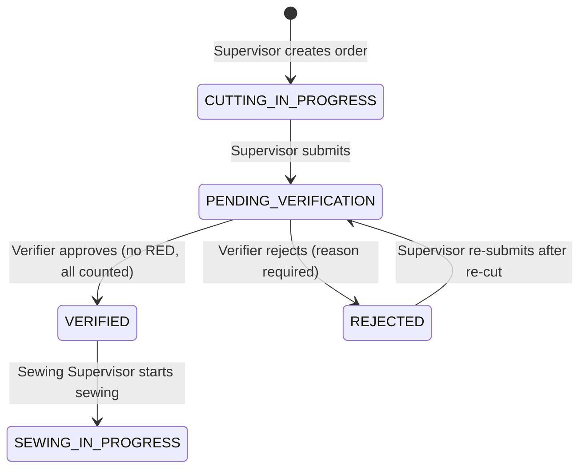
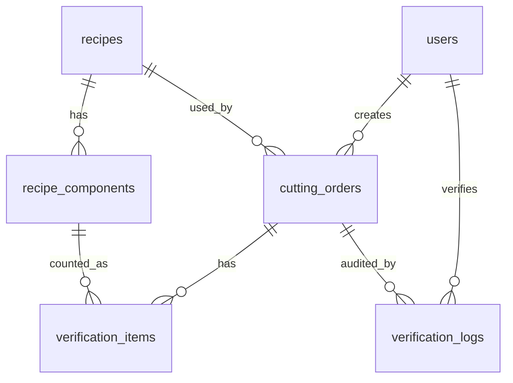

# ApparelFlow ERP — Cutting Operations & Gatekeeper Verification Terminal

A full-stack checkpoint between the **cutting floor** and the **sewing line** of a garment factory.
Cut batches can only reach sewing after a QC verifier has counted every component and the
**server** has confirmed there is no shortage.

| | |
|---|---|
| **Live app** | https://apparelflow-six.vercel.app |
| **Repository** | https://github.com/minsadiwanninayake/apparelflow |
| **Tests** | `npm test` — 33 passing (Vitest) |
| **AI report** | [`AI_OPTIMIZATION_REPORT.md`](./AI_OPTIMIZATION_REPORT.md) |

---

## 1. Demo credentials

Use the **Demo Credential Panel** on the login page (one click per role), or sign in manually.
Password for all accounts: **`Demo@1234`**

| Role | Email | Can do | Cannot do |
|---|---|---|---|
| Cutting Supervisor | `supervisor@apparelflow.dev` | Create cutting orders, log fabric, submit / re-submit for QC | Verify batches, see the Sewing Queue |
| Cutting Verifier | `verifier@apparelflow.dev` | Count pieces, approve or reject batches | Create orders, see the Sewing Queue |
| Sewing Supervisor | `sewing@apparelflow.dev` | See verified batches + audit record, start sewing | See cutting, pending or rejected orders |

Use **Switch role** (top right) to move between personas.

---

## 2. Five-minute evaluator walkthrough

1. **Supervisor** → **+ New Cutting Order** → `REC-BL01`, quantity `50`, roll `FAB-ROLL-882`, fabric `92.5`.
   The modal shows live expected counts (e.g. Sleeve Cuffs = 50 × 2 = **100**). Try `5.5`, `-3`, `abc` or an empty field to see inline errors.
2. Click **Submit for verification**.
3. **Verifier** → enter a shortage (e.g. Sleeves `96` of `100`). The row turns **RED / SHORTAGE** and **Approve Batch is disabled**.
   The API also rejects it with **422** (see §6).
4. Enter a reason and **Reject Batch** → Supervisor sees the reason and can **Re-submit after re-cut**.
5. Count every component exactly (or with excess) → **Approve Batch**.
6. **Sewing Supervisor** → the batch appears with the verifier's name, ID, timestamp, variances and wastage %. Refresh — it persists.

---

## 3. Tech stack

| Layer | Choice | Why |
|---|---|---|
| Framework | **Next.js 16** (App Router, TypeScript) | One deployable for UI + API routes |
| Database | **PostgreSQL on Neon** | Real relational DB, free tier, branchable for tests |
| ORM | **Prisma 6** | Typed queries, versioned migrations |
| Auth | **JWT (HS256, `jose`) in an httpOnly cookie**, passwords hashed with **bcrypt** | Stateless sessions; role travels inside a signed token |
| Validation | **Zod** — one schema shared by browser and server | Same rules everywhere; server is the authority |
| Styling | **Tailwind CSS 4** | Explicit high-contrast colours |
| Tests | **Vitest** against a separate Neon `test` branch | Real database, never production data |
| Hosting | **Vercel** | Git-based deploys |

---

## 4. Architecture

```
src/
├── app/
│   ├── login/                 Login form + Demo Credential Panel
│   ├── supervisor/            Cutting orders (role-guarded page)
│   ├── verifier/              Verification terminal (role-guarded page)
│   ├── sewing/                Sewing queue (role-guarded page)
│   └── api/
│       ├── auth/              login · logout · me
│       ├── recipes/           GET recipes + components
│       ├── orders/            GET list · POST create
│       │   └── [id]/          submit · approve · reject
│       ├── verify/pending/    GET orders waiting for QC
│       └── sewing/            queue (GET) · [id]/start (POST)
├── components/                UI (modal, order list, terminal, sewing board)
└── lib/
    ├── auth.ts                getSessionUser · requireRole (API) · requirePageRole (pages)
    ├── session.ts             JWT sign / verify, cookie options
    ├── domain.ts              Pure business rules (multiplier, traffic light, hard stop, wastage)
    ├── validation.ts          Zod schemas shared by client and server
    ├── queries.ts             Read models (plain objects for client components)
    └── db.ts                  Prisma client singleton
prisma/
├── schema.prisma
├── migrations/                init + immutable_audit_log (DB trigger)
└── seed.ts                    3 users, 2 recipes, 10 components
tests/                         Vitest: API integration + domain unit tests
```

**Request flow for any protected action**

```
Browser ──► API route ──► requireRole()  ── 401 / 403
                     ──► Zod validation  ── 422
                     ──► load order      ── 404
                     ──► state check     ── 409
                     ──► business rule   ── 422 (hard stop)
                     ──► one DB transaction (status + data + audit log)
```

Business rules live in `lib/domain.ts` as pure functions. The UI uses them for instant feedback;
the API **recalculates them** on every request and never trusts values computed in the browser.

---

## 5. Manufacturing state machine



| Transition | Endpoint | Allowed role | Guard |
|---|---|---|---|
| create → `CUTTING_IN_PROGRESS` | `POST /api/orders` | cutting_supervisor | Zod input rules |
| → `PENDING_VERIFICATION` | `POST /api/orders/:id/submit` | cutting_supervisor | only from `CUTTING_IN_PROGRESS` or `REJECTED`; old counts cleared |
| → `VERIFIED` | `POST /api/orders/:id/approve` | cutting_verifier | only from `PENDING_VERIFICATION`; **hard stop** |
| → `REJECTED` | `POST /api/orders/:id/reject` | cutting_verifier | only from `PENDING_VERIFICATION`; note ≥ 10 chars |
| → `SEWING_IN_PROGRESS` | `POST /api/sewing/:id/start` | sewing_supervisor | only from `VERIFIED` |

Every transition uses a **conditional update** (`UPDATE … WHERE id = ? AND status IN (allowed)`).
If two people click at the same time, only one update succeeds; the other gets **409**.

---

## 6. Business rules

| Rule | Implementation |
|---|---|
| **Multiplier engine** | `expected = targetQty × piecesPerGarment` (50 garments × 2 cuffs = 100). Stored per component in `verification_items` when the order is created. |
| **Traffic light** | `GREEN` actual = expected · `YELLOW` actual > expected (excess, may proceed) · `RED` actual < expected (shortage). |
| **Hard stop** | Approve is blocked if **any** component is RED **or not counted**. Disabled in the UI **and** rejected by the API with **422**. |
| **Fabric wastage** | `(actualYds − stdYdsPerPiece × qty) ÷ (stdYdsPerPiece × qty) × 100`, rounded to 2 dp. 92.5 vs 90 yds = **+2.78 %**. Shown against the recipe cap; over-cap is **flagged**, not blocked (the brief only blocks on shortages). |
| **Rejection** | Reason required (10–1000 chars). Any counts entered are saved to the audit log. |

---

## 7. Database schema



| Table | Key columns | Notes |
|---|---|---|
| `users` | id, email (unique), password_hash, role, full_name, created_at | role is a Postgres enum |
| `recipes` | id, recipe_code (unique), name, category, std_fabric_yards `DECIMAL(6,2)`, wastage_cap `DECIMAL(5,2)` | Seeded: REC-BL01, REC-CT02 |
| `recipe_components` | id, recipe_id, component_name, pieces_per_garment, image_url | unique (recipe_id, component_name) |
| `cutting_orders` | id, order_no (unique), recipe_id, target_qty, fabric_roll_id, actual_fabric_yds `DECIMAL(10,2)`, status, created_by, created_at, updated_at | index on status |
| `verification_items` | id, order_id, component_id, expected_qty, actual_qty, status (GREEN/YELLOW/RED) | unique (order_id, component_id) |
| `verification_logs` | id, order_id, verifier_id, decision (APPROVED/REJECTED), rejection_note, wastage_pct, variances `JSONB`, timestamp | **append-only** |

**Immutable audit trail.** Migration `immutable_audit_log` adds a PostgreSQL trigger that raises
`verification_logs is append-only` on any `UPDATE` or `DELETE`. A bug in the app, or a stray query
through the app's connection, cannot change an approval after it is written (only a deliberate
schema change that drops the trigger could).
`verifier_id` and `timestamp` come from the server session and database clock, never from the request body.

Money-like values (yards, percentages) use `DECIMAL`, not floating point.

---

## 8. Security contract

### Role-based access (enforced on the server)

| Endpoint | Supervisor | Verifier | Sewing | No session |
|---|---|---|---|---|
| `POST /api/orders` | ✅ | 403 | 403 | 401 |
| `POST /api/orders/:id/submit` | ✅ | 403 | 403 | 401 |
| `GET /api/verify/pending` | 403 | ✅ | 403 | 401 |
| `POST /api/orders/:id/approve` | 403 | ✅ | 403 | 401 |
| `POST /api/orders/:id/reject` | 403 | ✅ | 403 | 401 |
| `GET /api/sewing/queue` | 403 | 403 | ✅ | 401 |
| `POST /api/sewing/:id/start` | 403 | 403 | ✅ | 401 |

Pages are also guarded on the server (`requirePageRole`): opening another role's page redirects
you to your own. Hidden buttons are a convenience, **not** the security boundary.

### Query isolation

`GET /api/sewing/queue` takes **no parameters**. The filter `status = 'VERIFIED'` is a constant in
server code, so `/api/sewing/queue?status=PENDING_VERIFICATION` still returns verified orders only.

### Try it yourself (browser console on the live site)

```js
// Logged in as Supervisor → expect 403
fetch("/api/orders/1/approve", { method: "POST", headers: { "Content-Type": "application/json" },
  body: JSON.stringify({ counts: [] }) }).then(r => console.log(r.status));

// Logged in as Verifier, with a pending order → one piece short → expect 422
const p = await (await fetch("/api/verify/pending")).json(); const o = p.orders[0];
const counts = o.items.map((i, n) => ({ componentId: i.componentId, actualQty: n === 0 ? i.expectedQty - 1 : i.expectedQty }));
const r = await fetch(`/api/orders/${o.id}/approve`, { method: "POST", headers: { "Content-Type": "application/json" }, body: JSON.stringify({ counts }) });
console.log(r.status, await r.json());
```

### Session

- JWT signed with HS256, 8-hour expiry (one shift), stored in an **httpOnly, SameSite=Lax** cookie (`Secure` in production).
- Login returns the same message for a wrong email or a wrong password.
- `JWT_SECRET` must be at least 32 characters or the server refuses to start a session.

---

## 9. Input guards & contrast

- Quantities use `type="text" inputMode="numeric"` plus the regex `^\d+$`, so `5.5`, `-3`, `abc`, `1e3` and empty values are rejected **before** any number conversion (no silent `parseInt("5.5") → 5`).
- Fabric yards accept up to 2 decimal places, must be > 0.
- Errors show inline under each field as you type; the server repeats every check and returns **422** with field messages.
- All inputs, selects and options have explicit dark text on white (`globals.css`), a visible 3 px focus outline, and `color-scheme: light`, so they stay legible even when the laptop is in dark mode.
- Traffic-light status uses **colour + icon + text** (`● MATCH`, `▲ EXCESS`, `■ SHORTAGE`), never colour alone.

---

## 10. Automated tests

```bash
npm run test:db   # resets the separate Neon "test" branch (migrations + seed) — never production
npm test          # runs Vitest
```

| Required test | File | Result |
|---|---|---|
| 1. All GREEN → approved, `VERIFIED`, audit log written with verifier ID from the session | `tests/api.test.ts` | ✅ |
| 2. One RED (and one uncounted) → **422**, order stays `PENDING_VERIFICATION` | `tests/api.test.ts` | ✅ |
| 3. Reject with empty / blank / missing note → **422** | `tests/api.test.ts` | ✅ |
| 4. Supervisor and Sewing roles → **403**; no session → **401** | `tests/api.test.ts` | ✅ |
| 5. Sewing queue returns only `VERIFIED`, never cutting / pending / rejected / sewing | `tests/api.test.ts` | ✅ |
| Bonus: `UPDATE` on `verification_logs` is refused by the DB trigger | `tests/api.test.ts` | ✅ |
| Domain rules + input guards (20 unit tests) | `tests/domain.test.ts` | ✅ |

**33 / 33 passing.** API tests call the real route handlers against the test database; only
`next/headers` is replaced so the test can supply a signed session cookie — JWT verification and
role checks run for real. A guard in `tests/setup.ts` refuses to run unless `APP_ENV=test`.

---

## 11. Run locally

Requirements: Node.js 22+, a PostgreSQL database (a free Neon project works).

```bash
git clone https://github.com/minsadiwanninayake/apparelflow.git
cd apparelflow
npm install
cp .env.example .env          # then fill in your values
npx prisma migrate deploy     # create tables + audit trigger
npx prisma db seed            # 3 users, 2 recipes
npm run dev                   # http://localhost:3000
```

### Environment variables

| Name | Purpose |
|---|---|
| `DATABASE_URL` | Pooled Postgres connection (used by the app) |
| `DIRECT_URL` | Direct connection (used by Prisma migrations) |
| `JWT_SECRET` | ≥ 32 random characters for signing sessions |

For tests, create `.env.test` with the same keys pointing to a **separate** database, plus `APP_ENV="test"`.

---

## 12. Development process

- Git flow: `main` (released) ← `developing` ← `feature/*` branches, merged with `--no-ff` so each feature is visible in history:
  `feature/database` → `feature/auth` → `feature/orders` → `feature/verification` → `feature/sewing-queue` → `feature/tests` → `docs/readme-report`.
- Each feature was tested by hand in the browser (including direct API calls from the console) before merging.

---

## 13. Known limitations & next steps

- **Latency:** the database is in AWS us-east-2; requests from Sri Lanka take ~1 s per query. Transactions use a 30 s timeout for this reason.
- No rate limiting on login and no CSRF token (SameSite=Lax cookies and JSON-only APIs reduce the risk).
- Wastage over the recipe cap is flagged, not blocked — a business decision to confirm with the factory.
- No pagination yet; fine for demo volumes.
- `recipe_components.image_url` exists in the schema but component images are not shown yet.
- The pipeline stops at `SEWING_IN_PROGRESS`; sewing completion is out of scope.
